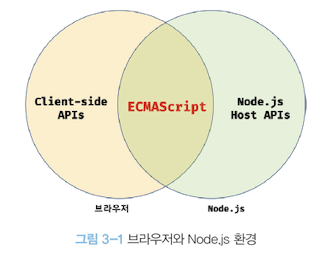

# 03장 자바스크립트 개발 환경과 실행 방법

## 자바스크립트 실행 환경

모든 브라우저 및 Node.js는 자바스크립트 엔진을 내장하고 있다. 주의해야 할 점은 브라우저와 Node.js의 용도가 다르다.
브라우저는 웹 페이지를 화면에 렌더링 하는 것이 주 목적이지만 Node.js는 브라우저 외부에서 자바스크립트 실행 환경을 제공하는 것이 주 목적이다.

따라서 브라우저와 Node.js 모두 자바스크립트의 코어인 ECMAScript를 실행할 수 있지만 ECMAScript 이외에 추가로 제공하는 기능은 호환하지 않는다.

;

## 웹 브라우저

이 책에서는 구글에 크롬 브라우저를 사용한다. 크롬은 ECMASCript 사양을 준수하고 시장 점유율도 가장 높다.

### 개발자 도구

개발자 도구는 웹 개발에 유용한 다양한 기능을 제공한다.

| 패널        | 설명                                                                                                                                                                                                         |
| ----------- | ------------------------------------------------------------------------------------------------------------------------------------------------------------------------------------------------------------ |
| Elements    | 로딩된 웹 페이지의 DOM과 CSS를 편집하여 렌더링된 뷰를 확인해 볼 수 있다. <br/> 단, 편집한 내용이 저장되지는 않는다. 웹 페이지가 의도된 대로 렌더링되지 않았다면 이 패널을 확인해 유용한 힌트를 얻을 수 있다. |
| Console     | 에러를 확인하거나 자바스크립트 소스코드에 작성한 console.log 메서드의 실행 결과를 확인할 수 있다.                                                                                                            |
| Sources     | 자바스크립트 코드를 디버깅할 수 있다.                                                                                                                                                                        |
| Network     | 페이지에 관련된 네트워크 요청 정보와 성능을 확인할 수 있다.                                                                                                                                                  |
| Application | 웹 스토리지, 세션, 쿠리르 확인, 관리할 수 있다.                                                                                                                                                              |

### 콘솔 (console)

어플리케이션이 정상적으로 동작하지 않을 때 에러를 확인할 수 있다. 개발 단계에서는 보통 열어둔 상태에서 개발한다. 그래야 에러를 바로 확인할 수 있기 때문이다.

그리고 콘솔은 자바스크립트 코드를 입력해 결과를 확인할 수 있는 REPL(Read Eval Print Loop) 환경으로 사용할 수도 있다.

### 브라우저에서 자바스크립트 실행

브라우저는 HTML 파일을 로드하면 script 태그에 포함된 자바스크립트 코드를 실행한다.

### 디버깅

콘솔에서 에러가 발생하는 위치에 대한 링크를 클릭하면 자바스크립트 코드를 디버깅할 수 있는 Sources 패널로 이동한다.

## Node.js

프레임워크 또는 라이브러리를 도입하거나 여러 도구를 사용하려면 Node.js와 npm이 필요하다.

### Node.js와 npm 소개

Node.js는 브라우저 이외의 환경에서 동작시킬 수 있는 실행 환경이다.

npm은 자바스크립트 패키지 매니저다.

### Node.js 설치

Node.js 홈페이지에서 다운로드를 받는다.

### Node.js REPL

터미널에서 아래와 같이 입력 후 실행

```jsx
$ node
Welcome to Node.js v14.3.0
> 1 + 2
3
$ node index.js
```

## 비주얼 스튜디오 코드

이 부분은 생략
