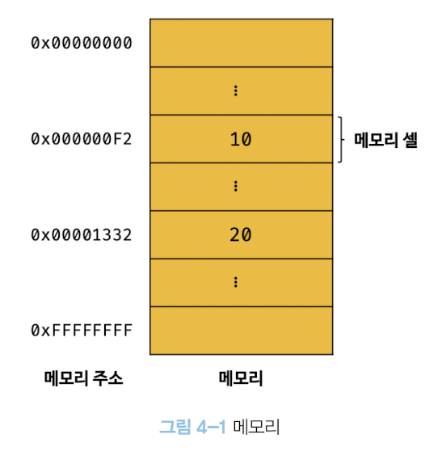
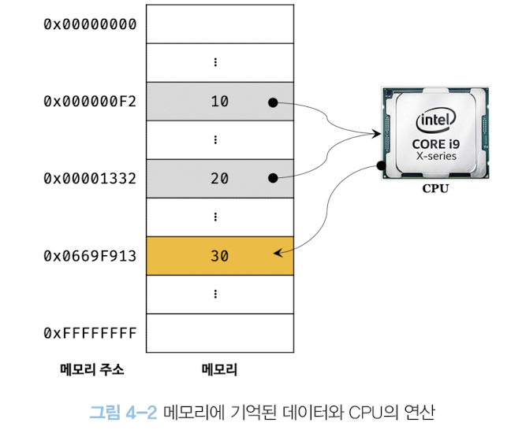
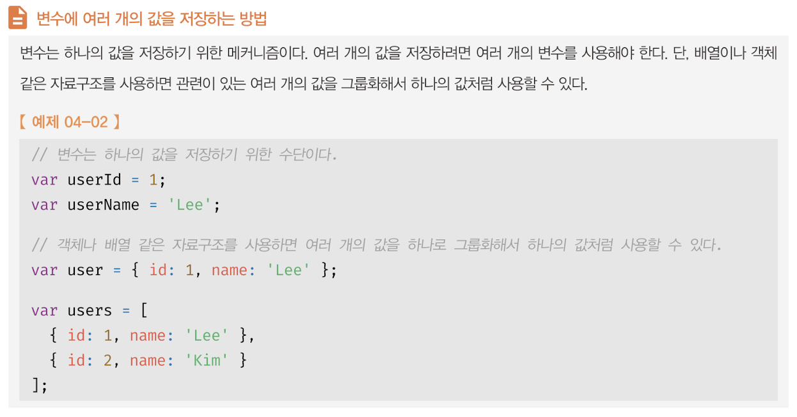
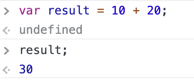
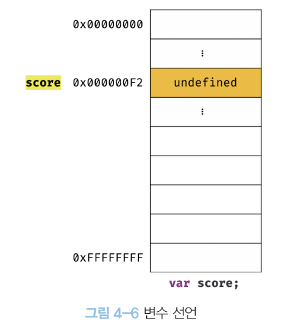
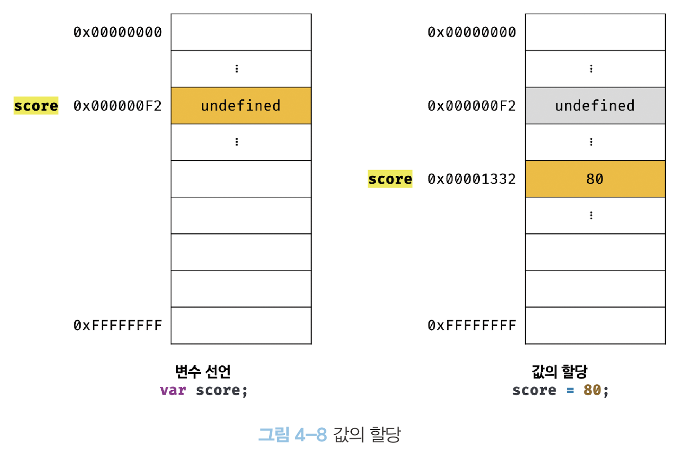
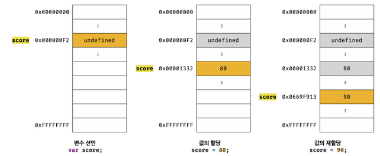

# 04장 변수

## 4-1 변수란 무엇인가? 왜 필요한가?

애플리케이션은 데이터를 다룬다. 규모가 크고 복잡한 애플리케이션이라 해도 데이터를 입력받고 그 결과를 출력하는 것이 전부다. 변수는 프로그래밍 언어에서 데이터를 관리하기 위한 핵심 개념이다.

```js
10 + 20;
```

위와 같은 자바스크립트 코드를 실행하면 컴퓨터는 어떤 일이 일어날까

컴퓨터는 사람을 모델로 디자인했기 때문에 유사하게 동작한다.
사람이 위 식을 계산하려면 10, 20, +라는 기호의 의미를 알고 있어야 하고 10 + 20이라는 식의 의미도 해석할 수 있어야 한다.
사람이 10 + 20이라는 식의 의미를 해석하면 + 기호의 의미인 덧셈을 하기 위해 10과 20을 기억하고 결과인 30도 기억한다.

컴퓨터, 정확히는 위 자바스크립트 코드를 실행하는 자바스크립트 엔진도 사람과 유사하게 실행한다.  
자바스크립트 엔진이 위 코드를 계산하려면 먼저 10, 20, +라는 기호의 의미를 알고 있어야 하며 10 + 20이라는 식(표현식)의 의미도 해석(파싱)할 수 있어야 한다.

자바스크립트 엔진이 10 + 20이라는 식의 의미를 해석하면 + 연산을 수행하기 위해 먼저 + 연산자의 좌변과 우변의 숫자 값,
즉 피 연산자를 기억한다.  
사람은 계산과 기억 모두 두뇌에서 하지만 컴퓨터는 CPU가 연산을 하고 메모리를 사용해서 데이터를 기억한다.

메모리는 데이터를 저장할 수 있는 메모리 셀의 집합체이다. 메모리 셀 하나의 크기는 1바이트(8비트)이며,  
컴퓨터는 메모리 셀의 크기, 즉 1바이트 단위로 데이터를 저장(write)하거나 읽어(read)들인다.



각 셀은 고유의 메모리 주소(memory address)를 갖는다. 이 메모리 주소는 메모리 공간의 위치를 나타내며,  
0부터 시작해 메모리의 크기만큼 정수로 표현된다. 예로 4GB 메모리는 0부터 4,424,967,295(0x00000000 ~ 0xFFFFFFFF)까지의 메모리 주소를 갖는다.

컴퓨터는 모든 데이터를 2진수로 처리한다. 따라서 메모리에 저장되는 모든 데이터는 2진수로 저장된다.

위 예제의 10과 20은 메모리 상의 임이의 위치(메모리 주소)에 기억(저장)되고 CPU는 이 값을 읽어 연산을 수행한다.
연산 결과도 메모리 상의 임의의 위치에 저장된다. 위 그림에서는 편의상 10진수로 표현했지만 실제로 메모리에 저장되는 모든 값은 2진수다.



성공적으로 연산이 끝나고 결과도 메모리에 저장이 되었지만 문제가 있다. 연산 결과인 값 30을 재사용할 수 없다.

연산 결과로 무언가를 하겠다는 의도가 있고 단 한 번만 사용하면 문제가 없겠지만 연산 결과를 재사용하고 싶다면 메모리 주소를 통해 연산 결과가 저장된 메모리 공간에 직접 접근하는 것 외에는 방법이 없다.

하지만 메모리 주소를 통해 값에 직접 접근하는 것은 시스템 오류가 발생하는 등 치명적인 오류를 일으키는 원인이 될 수 있다.
따라서 자바스크립트는 개발자의 직접적인 메모리 제어를 허용하지 않는다.

만약 자바스크립트가 직접적인 메모리 제어를 허용하더라도 값이 저장될 메모리 주소는 코드가 실행될 때마다 메모리 상황에 따라서 임의로 결정되는데 동일한 컴퓨터에서 같은 코드를 실행해도 메모리 주소는 매번 변경이 된다. 코드가 실행된 후에 메모리 주소를 알 수 있기 때문에 메모리 주소를 통해 값에 직접 접근하려는 시도는 올바른 방법이 아니다.

프로그래밍 언어는 기억하고 싶은 값을 메모리에 저장하고, 저장된 값을 읽어 들여 재사용하기 위해서 변수라는 메커니즘을 제공한다. 변수의 정의를 내려보면 다음과 같다.

> 변수는 하나의 값을 저장하기 위해 확보한 메모리 공간 자체 또는 그 메모리 공간을 식별하기 위해 붙인 이름을 말한다.

변수는 프로그래밍 언어에서 값을 저장하고 참조하는 메커니즘으로 **값의 위치를 가르키는 상징적인 이름**이다.

상징적 이름인 변수는 프로그래밍 언어의 컴파일러 또는 인터프리터에 의해 값이 저장된 메모리 공간의 주소로 치환되어 실행된다. 개발자가 직접 메모리 주소를 통해 값을 저장, 참조하는 것이 아닌 변수를 통해 안전하게 사용할 수 있다.



```js
var result = 10 + 20;
```

10 + 20의 결과 값은 30이다. 결과 값은 메모리 공간에 저장이 된다. 이때 재사용할 수 있도록 값이 저장된 메모리 공간에 상직적인 이름을 붙인 것이 변수다.

위 예제에서의 result는 변수 이름(변수명) 그리고 변수에 저장된 값은 변수 값이라고 한다.
변수에 값을 저장하는 것을 할당(대입, 저장)이라 하고 변수에 저장된 값을 읽어 들이는 것을 참조라고 한다.

변수명은 사람을 위해 사람이 이해할 수 있는 언어로 값이 저장된 메모리 공간에 붙인 상징적인 이름이다.
변수 이름을 사용해 참조를 요청하면 자바스크립트 엔진은 변수 이름과 매핑된 메모리 주소를 통해 메모리 공간에 접근해서 저장된 값을 반환한다.



사람이 이해할 수 있는 언어로 만든 변수명을 통해 변수에 저장된 값의 의미를 명확히 할 수 있다.  
따라서 좋은 이름, 즉 변수에 저장된 값이 뭔지 쉽게 파악할 수 있는 변수명은 가독성을 높이는 부수적인 효과도 있다.
개발자의 의도를 나타내는 명확한 네이밍은 코드를 이해하기 쉽게 만들어주고 이는 협업과 품질 향상에 도움을 준다.

---

## 4-2 식별자

변수 이름을 식별자라고도 한다. **식별자는 어떤 값을 구별해서 식별할 수 있는 고유한 이름**을 말한다.  
사람을 이름으로 구별해서 식별하는 것 처럼 값도 식별자로 구별해서 식별할 수 있다.

메모리 공간에 저장되어 있는 값을 식별자는 메모리 주소를 기억(저장)하고 있어야 메모리 공간에 있는 어떤 값을 구별해서 식별할 수 있다. 식별자는 값이 저장되어 있는 메모리 주소와 매핑 관계를 맺으며 이 매핑 정보도 메ㅗㅁ리에 저장되어야 한다.

이처럼 식별자는 **값을 저장하는 게 아닌 메모리 주소를 기억**하고 있다. 식별자로 값을 구별해서 식별한다는 것은 식별자가 기억하고 있는 메모리 주소를 통해 메모리 공간에 저장된 값에 접근할 수 있다는 것이다.  
식별자는 메모리 주소에 붙인 이름이라고 할 수 있다.

변수 이름에만 국한해서 식별자라는 용어를 사용하지 않는다. 변수 이외에도 함수, 클래스 등의 이름은 모두 식별자다.  
메모리 상에 존재하는 어떤 값을 식별할 수 있는 이름은 모두 식별자라고 부른다 .  
변수, 함수, 클래스 등의 이름과 같은 식별자는 네이밍 규칙을 준수해야 하며 **선언**에 의해 자바스크립트 엔진에 식별자의 존재를 알린다.

---

## 4-3 변수 선언

변수 선언이란 변수를 생성하는 것을 말한다.
자세히 설명하면 값을 저장하기 위한 메모리 공간을 확보하고 변수 이름과 메모리 공간의 주소를 연결해서 값을 저장할 수 있게 준비하는 것이다.  
변수 선언에 의해 확보된 메모리 공간은 확보가 해제되기 전에는 누구도 그 공간을 사용할 수 없도록 보호된다.

자바스크립트에서 변수를 사용하려면 선언이 필요하다. 선언 키워드는 총 3가지다

- var
- let
- const

> ### 키워드란?
>
> 자바스크립트 코드를 해석하고 실행하는 자바스크립트 엔진이 수행할 동작을 규정한 일종의 명령어다.

ES6 이전에는 var 키워드만 사용 가능했다.

> ### var vs let, const
>
> var 키워드는 여러 단점이 있다. 대표적으로 var는 블록 레벨 스코프가 아닌 함수 레벨 스코프이다.  
> 이로 인해 의도치 않게 전역 변수가 선언되어 오류를 발생시키기도 한다.  
> 자세한건 이후에 알아보도록 한다.

이제 변수를 선언해보자

```js
var score;
```

위 예제처럼 var 키워드를 사용해 변수를 선언할 수 있다.  
변수 선언문은 변수 이름을 등록하고 값을 저장할 메모리 공간을 확보한다.


자바스크립트의 특징 중 하나인데 값을 할당하지 않고 변수를 선언하게 되면 암묵적으로 **undefined**라는 값이 할당되어 초기화된다.

자바스크립트 엔진은 2단계에 거쳐 변수 선언을 한다.

1. 선언 단계: 변수 이름을 등록해서 자바스크립트 엔진에 변수의 존재를 알린다.
2. 초기화 단계: 값을 저장하기 위한 메모리 공간을 확보하고 암묵적으로 undefined를 할당해 초기화한다.

> ### 변수 이름은 어디에 등록되는가?
>
> 변수 이름을 비록하여 모든 식별자는 실행 컨텍스트에 등록된다.  
> 실행 컨텍스트란 자바스크립트 엔진이 소스코드를 평가하고 실행하기 위해 필요한 환경을 제공하고 코드의 실행 결과를 실제로 관리하는 영역이다.
> 자바스크립트 엔진은 실행 컨텍스트를 통해 식별자와 스코프를 관리한다.
> 변수 이름과 변수 값은 실행 커텍스트 내에 key/value 형식인 객체로 등록되어 관리된다.

일반적으로 초기화란 변수가 선언된 이후 최초로 값을 할당하는 것을 말한다.  
만약 변수 선언 단계 이후에 초기화 단계까 없다면 확보된 메모리 공간에 다른 애플리케이션이 사용했던 값이 남아있을 수 있다.  
이러한 값을 쓰레기 값(garbage value)이라 한다.

모든 식별자는 선언해야 사용할 수 있다. 만약 선언하지 않은 식별자에 접근하면 ReferenceError(참조 에러)가 발생한다.

## 4-4 변수 선언의 실행 시점과 변수 호이스팅

```js
console.log(score);
var score;
```

위 예제를 보자 score 변수를 참조하는 코드가 변수 선언문보다 앞에 있다.  
score에는 어떤 값이 출력될까 바로 undefined다. 이제 그 이유를 알아보자.

자바스크립트 코드는 인터프리터에 의해 한 줄씩 순차 실행되므로 위 코드를 실행하면 참조 에러가 발생할거라 생각할 수 있다.  
하지만 undefined가 출력되는 이유는 변수 선언은 런타임이 아닌 그 이전 단계에서 먼저 실행되기 때문이다.

자바스크립트 엔진은 실행하기 이전에 소스코드의 평가 과정을 거치면서 실행하기 위한 준비를 한다.  
이때 모든 선언문을 소스코드에서 찾아내 먼저 실행한다.

설명처럼 변수 선언이 런타임 이전 단계에서 먼저 실행되는 자바스크립트의 고유 특징을 **변수 호이스팅**이라고 한다.  
모든 식별자는 호이스팅되어 런타임 이전 단계에서 실행된다.

## 4-5 값의 할당

변수에 값을 할당할 때 할당 연산자인 =를 사용한다. 우변의 값을 좌변의 변수에 할당한다.

```js
var score;
score = 80;
```

변수 선언과 값의 할당을 하나의 문으로 단축 표현할 수도 있다.

```js
var score = 80;
```

자바스크립트 엔진은 변수 선언과 값의 할당을 2개의 문으로 나누어 각각 실행한다.  
이때 주의할 점은 변수 선언과 값의 할당 실행 시점이 다르다.  
**변수 선언은 런타임 이전에 먼저 실행되지만 값의 할당은 런타임에 실행된다.**

```js
console.log(score); // (1)

var score;
score = 80;

console.log(score); // (2)
```

위 예제의 (1), (2)는 어떤 게 출력될까 맞춰보자.  
정답은 (1): undefined, (2): 80이다.  
이유는 var score; 즉 변수 선언은 런타임 이전에 실행되고 score = 80 즉 값의 할당은 런타임에 실행된다.  
그렇기 때문에 (1)에서 undefined (2)에서 80이 출력된다.

변수 선언과 값의 할당을 단축 표현하여 코드를 작성해도 위와 같은 방식으로 동작한다.
아래 예제 코드를 확인해보자.

```js
console.log(score); // undefined

var score = 80;

console.log(score); // 80
```



## 4-6 값의 재할당

```js
var score = 80;
score = 90;
```

var 키워드로 선언한 변수는 값을 재할당할 수 있다.  
재할당이란 현재 변수에 저장된 값을 버리고 새로운 값을 저장하는 것이다.
var 키워드로 선언한 변수는 선언과 동시에 undefined로 초기화하기 때문에 변수에 처음으로 값을 할당하는 것도 사실은 재할당이다.

**재할당하지 못하는 즉 변수에 저장된 값을 변경할 수 없다면 그건 변수가 아니라 상수라고 한다.**

> ### const 키워드
>
> ES6에 도입된 const 키워드를 사용해 선언한 변수는 재할당이 금지된다.  
> 한 번만 할당할 수 있는 변수를 선언하는 키워드이다.
>
> ```js
> const foo = 10;
> foo = 100;
> // Uncaught TypeError: Assignment to constant variable.
> ```



변수에 값을 재할당하면 변수의 값은 이전 값에서 재할당한 값으로 변경된다.  
처음 값을 할당하는 것과 마찬가지로 저장되어 있던 메모리 공간을 지우고 그 메모리 공간에 새로운 값을 저장하는 게 아닌 새로운 메모리 공간을 확보하고 확보한 메모리 공간에 새로운 값을 저장한다.

그럼 이전 값은 어떠한 변수도 갖지 않는 값이 되는데 이런 불필요한 값들은 **가비지 콜렉터**에 의해 메모리에서 자동 해제된다. 단, 메모리에서 언제 해제될지는 예측할 수 없다.

> ### 가비지 콜렉터 (garbage collector)
>
> 애플리케이션이 할당한 메모리 공간을 주기적으로 검사하여 더 이상 사용되지 않는 메모리를 해제하는 기능을 말한다.
> 어떠한 식별자도 참조하지 않는 메모리 공간을 더 이상 사용하지 않는 메모리라 하며 자바스크립트는 가비지 콜렉터를 내장하고 있는 매니지드 언어로서 가비지 콜렉터를 통해 메모리 누수를 방지한다.

> ### 언배니지드 언어(unmanaged language)와 매니지드 언어(managed language)
>
> 메모리 관리 방식에 따라 프로그래밍 언어는 언매니지드 언어와 매니지드 언어로 분류할 수 있다.
> C 언어와 같은 언매니지드 언어는 개발자가 명시적으로 메모리를 할당하고 해제하기 위해 malloc(), free()와 같은 저수준 메모리 제어 기능을 제공한다.
> 개발자가 메모리 제어를 주도할 수 있으므로 개발자 역량에 따라 최적의 성능을 확보할 수 있다는 장점이 있지만 반대로 치명적인 오류를 발생시킬 수 있다.
>
> 자바스크립트와 같은 매니지드 언어는 메모리 할당 및 해제 즉 메모리 관리 기능을 언어에서 담당하고 개발자의 직접적인 메모리 제어를 허용하지 않는다. 더 이상 사용하지 않는 메모리의 해제는 가비지 콜렉터가 수행한다.
> 매니지드 언어는 개발자의 역량에 의존하는 부분이 상대적으로 적어져 어느 정도 일정한 생산성을 확보할 수 있는 장점이 있지만 성능 면에서 어느 정도의 손실을 감수해야 한다.

## 4-7 식별자 네이밍 규칙

앞에서 말한 것 처럼 식별자는 어떤 값을 구별해서 식별할 수 있는 고유한 이름을 말한다.  
식별자는 다음과 같은 네이밍 규칙을 준수해야 한다.

- 식별자는 특수문자를 제외한 문자, 숫자, 언더스코어(\_), 달러 기호($)를 포함할 수 있다.
- 단, 식별자는 특수문자를 제외한 문자, 언더스코어(\_), 달러 기호($)로 시작해야 한다. 숫자로 시작하는 것은 허용하지 않는다.
- 예약어는 식별자로 사용할 수 없다.
  <details markdown="1">
  <summary>예약어</summary>
    <pre>
      - await
      - break
      - case
      - catch
      - class
      - const
      - continue
      - debugger
      - default
      - delete
      - do
      - else
      - enum
      - export
      - extends
      - false
      - finally
      - for
      - function
      - if
      - implements*
      - import
      - in
      - instanceof
      - interface*
      - let*
      - new
      - null
      - package*
      - private*
      - protected*
      - public*
      - return
      - super
      - static*
      - switch
      - this
      - throw
      - true
      - try
      - typeof
      - var
      - void
      - while
      - with
      - yield*

       * 표시가 된 건 식별자로 사용 가능하나 stirct mode에서는 사용 불가

    </pre>
  </details>

---

변수 이름도 식별자이므로 위 네이밍 규칙을 따라야 한다.

```js
var person, $elem, _name, first_name, val1;
```

위 예제 코드 처럼 하나의 문에서 여러 개를 한번에 선언할 수 있다. 하지만 가독성이 나빠지므로 권장하지 않는다.

---

```js
var 이름;
```

ES5부터 식별자를 만들 때 유니코드 문자를 허용하므로 알파벳 외의 한글이나 일본어 식별자도 사용할 수 있다. 하지만 알파벳 외의 유니코드 문자로 명명된 식별자를 사용하는 것은 바람직하지 않다.

---

```js
var first-name; // Uncaught SyntaxError: Unexpected token '-'
var 1st;        // Uncaught SyntaxError: Invalid or unexpected token
var this;       // Uncaught SyntaxError: Unexpected token 'this'
```

명명 규칙에 위배하므로 변수 이름으로 사용할 수 없다.

---

```js
var fistname;
var firtsName;
var FIRSTNAME;
```

자바스크립트는 대소문자를 구별하므로 위 3개 변수는 각각 별개의 변수다.

---

```js
var x = 3;
var score = 100;
```

위 코드에 x 변수처럼 변수의 목적이 무엇인지 명확히 나타내지 않으면 개발 시 어려움을 겪을 수 있다.  
변수 이름은 해당 변수의 목적을 명확히 표현해야 하며 좋은 변수 이름은 코드의 가독성을 높인다.

---

```js
// 경과 시간, 단위는 날짜다.
var d;
var elapsedTimeInDays;
```

위 d 변수처럼 명확하지 않는 변수 이름을 사용하면 코드 가동성이 떨어지는 걸 볼 수 있다.

아래의 4가지 유형의 네이밍 컨벤션이 자주 사용된다.

```js
// (1)
var firstName;

// (2)
var first_name;

// (3)
var FirstName;

// (4)
var strFirstName;
var $elem = document.getElementById("App");
var observable$ = fromEvent(document, "click");
```

1. 카멜 케이스 (camelCase)
   - 자바스크립트에서 일반적으로 변수나 함수 이름에서 카멜 케이스를 사용한다.
2. 스네이크 케이스 (snake_case)
   - 자바스크립트에서 일반적으로 생성자 함수, 클래스 이름에 파스칼 케이스를 사용한다.
3. 파스칼 케이스 (PascalCase)
4. 헝가리언 케이스 (typeHungarianCase)

ECMAScript 사양에 정의되어 있는 객체와 함수들도 카멜 케이스와 파스칼 케이스를 사용하고 있다.  
따라서 코드 전체의 가독성을 높이려면 카멜 케이스와 파스칼 케이스를 따르는 것이 유리하다.
